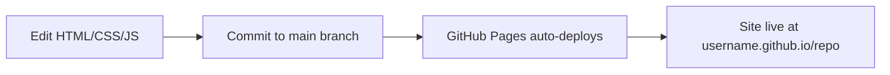

# Design Document: Extreme Electronics Website

## Overview

This document describes the technical design for the Extreme Electronics portfolio website — a static, single-page site showcasing the company's projects in AI/ML, Electronics, and Mechatronics. The site is built with plain HTML, CSS (Tailwind via CDN), and vanilla JavaScript, requiring no build step and deployable directly to GitHub Pages.

The design prioritizes simplicity, fast load times, and a professional dark-themed aesthetic appropriate for a technology company. All interactivity (navigation, filtering, mobile menu) is implemented with progressive enhancement so core content remains accessible without JavaScript.

## Architecture

### High-Level Structure

```
┌─────────────────────────────────────────────┐
│              GitHub Pages (Host)             │
├─────────────────────────────────────────────┤
│                                             │
│  index.html (single page, all sections)     │
│  ├── <head> Tailwind CDN, meta, fonts       │
│  ├── <nav> Navigation Bar                   │
│  ├── <section#hero> Hero Section            │
│  ├── <section#projects> Project Showcase    │
│  ├── <section#about> About Section          │
│  ├── <section#contact> Contact Section      │
│  └── <footer> Footer                        │
│                                             │
│  css/styles.css (custom styles)             │
│  js/main.js (interactivity)                 │
│  images/ (project images)                   │
│                                             │
└─────────────────────────────────────────────┘
```

### Design Decisions

| Decision | Choice | Rationale |
|----------|--------|-----------|
| Page structure | Single HTML file | Simpler deployment, no routing needed, all content is one scroll |
| CSS framework | Tailwind CSS via CDN | Rapid styling, utility-first, no build step required |
| Custom CSS | Separate `css/styles.css` | Animations, custom properties, and overrides that Tailwind CDN doesn't cover |
| JavaScript | Single `js/main.js` | Minimal interactivity (filter, menu toggle), no need for modules |
| Images | Local `images/` directory | Fast loading, no external dependencies, version controlled |
| Fonts | Google Fonts via CDN | Professional typography without self-hosting |

### Deployment Flow



## Components and Interfaces

### 1. Navigation Bar Component

**Element:** `<nav>` fixed at viewport top

**Behavior:**
- Desktop (≥768px): Horizontal link list (Home, Projects, About, Contact)
- Mobile (<768px): Hamburger icon that toggles a vertical dropdown menu
- Smooth scroll to target section on link click
- Stays fixed at top during scroll (`position: fixed`)

**HTML Structure:**
```html
<nav id="navbar" class="fixed top-0 w-full z-50 bg-gray-900/95 backdrop-blur">
  <div class="container mx-auto flex justify-between items-center p-4">
    <a href="#" class="text-xl font-bold text-white">Extreme Electronics</a>
    <button id="menu-toggle" class="md:hidden text-white">
      <!-- Hamburger icon SVG -->
    </button>
    <ul id="nav-links" class="hidden md:flex space-x-8">
      <li><a href="#hero" class="nav-link">Home</a></li>
      <li><a href="#projects" class="nav-link">Projects</a></li>
      <li><a href="#about" class="nav-link">About</a></li>
      <li><a href="#contact" class="nav-link">Contact</a></li>
    </ul>
  </div>
  <!-- Mobile menu (hidden by default) -->
  <ul id="mobile-menu" class="hidden flex-col md:hidden">
    <!-- Same links, vertical layout -->
  </ul>
</nav>
```

**JavaScript Interface:**
```javascript
// Toggle mobile menu visibility
function toggleMobileMenu() { ... }

// Smooth scroll to section
function scrollToSection(sectionId) { ... }
```

### 2. Hero Section Component

**Element:** `<section id="hero">` — full viewport height

**Content:**
- Company name: "Extreme Electronics"
- Tagline describing AI/ML, Electronics, and Mechatronics expertise
- CTA button linking to `#projects`

**HTML Structure:**
```html
<section id="hero" class="min-h-screen flex items-center justify-center bg-gradient-to-br from-gray-900 via-blue-900 to-gray-900">
  <div class="text-center px-4">
    <h1 class="text-5xl md:text-7xl font-bold text-white">Extreme Electronics</h1>
    <p class="text-xl md:text-2xl text-gray-300 mt-4">AI/ML • Electronics • Mechatronics</p>
    <a href="#projects" class="mt-8 inline-block px-8 py-3 bg-blue-600 hover:bg-blue-500 text-white rounded-lg transition-colors">
      View Our Projects
    </a>
  </div>
</section>
```

### 3. Project Showcase Component

**Element:** `<section id="projects">` containing filter controls and project grid

**Sub-components:**

#### Domain Filter
```html
<div id="domain-filter" class="flex flex-wrap justify-center gap-4 mb-8">
  <button class="filter-btn active" data-filter="all">All</button>
  <button class="filter-btn" data-filter="ai-ml">AI/ML</button>
  <button class="filter-btn" data-filter="electronics">Electronics</button>
  <button class="filter-btn" data-filter="mechatronics">Mechatronics</button>
</div>
```

#### Project Card
```html
<div class="project-card" data-domain="ai-ml mechatronics" data-type="hardware software">
  
  <div class="p-4">
    <h3 class="text-xl font-bold text-white">Project Title</h3>
    <p class="text-gray-400 mt-2">Brief project description...</p>
    <div class="flex flex-wrap gap-2 mt-3">
      <span class="tag tag-ai">AI/ML</span>
      <span class="tag tag-mechatronics">Mechatronics</span>
      <span class="tag tag-hardware">Hardware</span>
      <span class="tag tag-software">Software</span>
    </div>
  </div>
</div>
```

**JavaScript Interface:**
```javascript
// Filter projects by domain
function filterProjects(domain) { ... }

// Animate card transitions (fade in/out)
function animateCards(visibleCards, hiddenCards) { ... }
```

**Project Grid Layout (Tailwind responsive):**
```html
<div id="project-grid" class="grid grid-cols-1 md:grid-cols-2 lg:grid-cols-3 gap-6">
  <!-- Project cards -->
</div>
```

### 4. About Section Component

**Element:** `<section id="about">`

**Content:**
- Company mission statement
- Three domain cards (AI/ML, Electronics, Mechatronics) each with capability descriptions

**HTML Structure:**
```html
<section id="about" class="py-20 bg-gray-800">
  <div class="container mx-auto px-4">
    <h2 class="text-3xl font-bold text-white text-center mb-12">About Us</h2>
    <p class="text-gray-300 text-center max-w-2xl mx-auto mb-12">Mission statement...</p>
    <div class="grid grid-cols-1 md:grid-cols-3 gap-8">
      <!-- Domain capability cards -->
      <div class="bg-gray-700 rounded-lg p-6">
        <h3 class="text-xl font-bold text-blue-400">AI/ML</h3>
        <p class="text-gray-300 mt-2">Capabilities description...</p>
      </div>
      <!-- Repeat for Electronics, Mechatronics -->
    </div>
  </div>
</section>
```

### 5. Contact Section Component

**Element:** `<section id="contact">`

**Content:**
- Contact methods (email, social media links)
- Clear, readable layout

**HTML Structure:**
```html
<section id="contact" class="py-20 bg-gray-900">
  <div class="container mx-auto px-4 text-center">
    <h2 class="text-3xl font-bold text-white mb-8">Get In Touch</h2>
    <div class="space-y-4">
      <a href="mailto:contact@extremeelectronics.com" class="text-blue-400 hover:text-blue-300">
        contact@extremeelectronics.com
      </a>
      <!-- Social media links -->
    </div>
  </div>
</section>
```

### 6. Footer Component

**Element:** `<footer>`

**Content:**
- Copyright notice with "Extreme Electronics"
- Navigation links mirroring the main nav
- Visually distinct (darker background or border separation)

```html
<footer class="bg-gray-950 border-t border-gray-800 py-8">
  <div class="container mx-auto px-4">
    <nav class="flex flex-wrap justify-center gap-6 mb-4">
      <a href="#hero">Home</a>
      <a href="#projects">Projects</a>
      <a href="#about">About</a>
      <a href="#contact">Contact</a>
    </nav>
    <p class="text-center text-gray-500">© 2024 Extreme Electronics. All rights reserved.</p>
  </div>
</footer>
```

## Data Models

### Project Data Structure

Projects are defined as a JavaScript array in `js/main.js` (no external data source needed):

```javascript
const projects = [
  {
    id: "apple-sorting",
    title: "Apple Sorting System",
    description: "AI-powered classification system with mechanical removal of bad apples on a conveyor belt.",
    image: "images/apple-sorting.jpg",
    domains: ["ai-ml", "mechatronics"],
    type: ["hardware", "software"]
  },
  {
    id: "drone-custom",
    title: "Custom Drone Builds",
    description: "Custom-built drones and modifications for specialized applications.",
    image: "images/drone.jpg",
    domains: ["electronics", "mechatronics"],
    type: ["hardware"]
  }
  // Additional projects...
];
```

### Filter State

```javascript
// Current active filter (default: "all")
let activeFilter = "all";
```

### Mobile Menu State

```javascript
// Whether mobile menu is open
let mobileMenuOpen = false;
```

## Error Handling

Since this is a static site with minimal JavaScript, error handling is lightweight:

| Scenario | Handling |
|----------|----------|
| Image fails to load | Use `alt` text and CSS background fallback color on card |
| JavaScript disabled | All content renders via HTML; filter buttons are non-functional but all projects remain visible (progressive enhancement) |
| Tailwind CDN fails | Custom `css/styles.css` provides basic layout fallback styles |
| Invalid anchor link | Browser handles gracefully (no scroll, no error) |
| Screen size edge cases | Tailwind responsive utilities handle all breakpoints; `min-width: 320px` tested |

### Progressive Enhancement Strategy

1. **HTML layer**: All content (text, images, links) is in semantic HTML and accessible without CSS or JS
2. **CSS layer**: Tailwind + custom styles add visual design, responsive grid, and hover effects
3. **JS layer**: Adds filtering animation, mobile menu toggle, and smooth scroll behavior

If JavaScript is disabled:
- All project cards remain visible (no filtering)
- Mobile menu links can be made visible via `<noscript>` styles or CSS-only toggle
- Smooth scroll degrades to instant jump (browser default)

## Testing Strategy

### Why Property-Based Testing Does Not Apply

This feature is a static website with:
- UI rendering and layout (HTML/CSS)
- Simple DOM manipulation (show/hide elements, toggle CSS classes)
- No pure functions with complex input/output behavior
- No parsers, serializers, or data transformations
- No algorithms operating over a wide input space

Property-based testing is not appropriate here. The testing strategy uses manual testing, example-based checks, and automated visual/functional testing instead.

### Testing Approach

#### 1. Manual Visual Testing
- Verify layout at breakpoints: 320px, 768px, 1024px, 1440px
- Verify dark theme consistency across all sections
- Verify hover states on buttons, cards, and links
- Verify smooth scroll behavior
- Verify hamburger menu open/close on mobile

#### 2. Functional Testing (Browser-Based)
- Navigation links scroll to correct sections
- Domain filter shows/hides correct project cards
- "All" filter shows all cards
- Filter animation plays smoothly
- Mobile menu toggles correctly
- CTA button scrolls to projects section

#### 3. Cross-Browser Testing
- Chrome, Firefox, Safari, Edge (latest versions)
- iOS Safari, Android Chrome (mobile)

#### 4. Accessibility Testing
- Keyboard navigation through all interactive elements
- Screen reader announces navigation, headings, and content correctly
- Color contrast meets WCAG AA (4.5:1 for text)
- Focus indicators visible on all interactive elements
- `alt` text present on all images

#### 5. Performance Testing
- Page loads above-the-fold content without JavaScript
- Total page weight under 2MB (including images)
- Lighthouse performance score ≥ 90

#### 6. Deployment Testing
- Site deploys correctly to GitHub Pages from main branch
- All relative paths resolve correctly on GitHub Pages
- No broken links or missing assets
